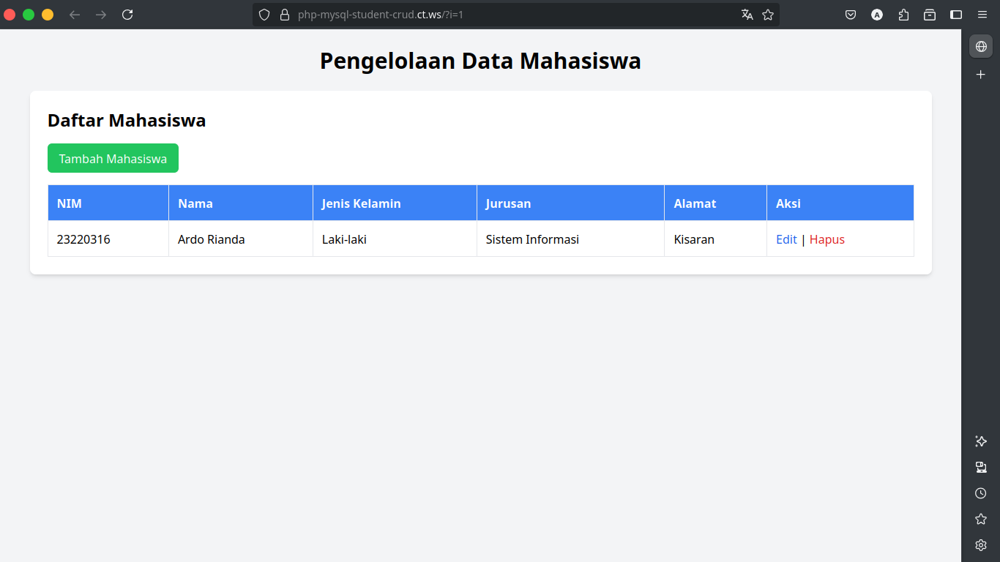
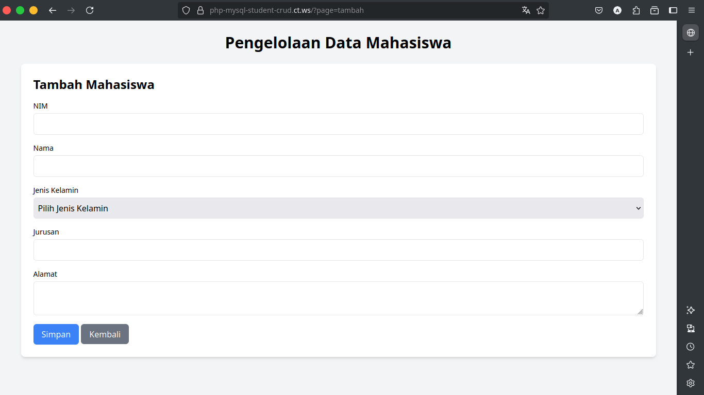

# PHP & MySQL - Student Data Management (CRUD)


## 📋 Project Description

This is a simple student data management application featuring full CRUD (Create, Read, Update, Delete) functionality. The project was developed as a final assignment for a Web Programming course, built with procedural PHP and a MySQL database, and styled with Tailwind CSS.

**➡️ [View Live Demo](http://php-mysql-student-crud.ct.ws)**

## ✨ Key Features

* **Create:** Add new student data through a form.
* **Read:** Display all student data in a structured table.
* **Update:** Edit existing student data.
* **Delete:** Remove student data from the database.

## 🛠️ Technologies Used

* **Backend:** PHP
* **Database:** MySQL
* **Frontend:** HTML, Tailwind CSS

## 📸 Screenshots

<p align="center">
  <em>Main Table View</em>
  <br>
  
</p>

<p align="center">
  <em>Add/Edit Form View</em>
  <br>
  
</p>

## 🚀 Installation and Setup

You can run this project on your local machine by choosing one of the following environments. You will need a PHP interpreter and a MySQL/MariaDB database server.

#### General Setup Steps:
1.  **Clone the repository:**
    ```bash
    git clone https://github.com/TWO-ONE-21/php-mysql-student-crud.git
    ```
2.  **Database Setup:**
    * Create a new database named `db_mahasiswa`.
    * Import the `schema.sql` file into your newly created database.
3.  **Configure Connection:**
    * Find the `koneksi.example.php` file.
    * Create a copy of it and rename it to `koneksi.php`.
    * Open `koneksi.php` and fill in your actual database credentials (username and password).

---

#### Choose Your Environment:

<details>
<summary>📦 <strong>Option 1: Using XAMPP</strong></summary>

1.  Place the project folder inside the `htdocs` directory in your XAMPP installation folder.
2.  Start the **Apache** and **MySQL** modules from the XAMPP Control Panel.
3.  Open your web browser and navigate to `http://localhost/php-mysql-student-crud`.

</details>

<details>
<summary>🐧 <strong>Option 2: Using a LAMP/LEMP Stack</strong></summary>

1.  Place the project folder inside your web server's root directory (e.g., `/var/www/html`).
2.  Ensure your Apache/Nginx and MySQL/MariaDB services are running.
3.  Open your web browser and navigate to `http://localhost/php-mysql-student-crud`.

</details>

<details>
<summary>⚙️ <strong>Option 3: Using PHP's Built-in Web Server (Manual Method)</strong></summary>

1.  Ensure your MariaDB/MySQL server is running.
2.  Open your terminal and navigate to the project's root directory.
3.  Run the following command:
    ```bash
    php -S localhost:8000
    ```
4.  Open your web browser and navigate to `http://localhost:8000`.

</details>

## 📄 License

This project is licensed under the MIT License. See the [LICENSE](LICENSE) file for details.
